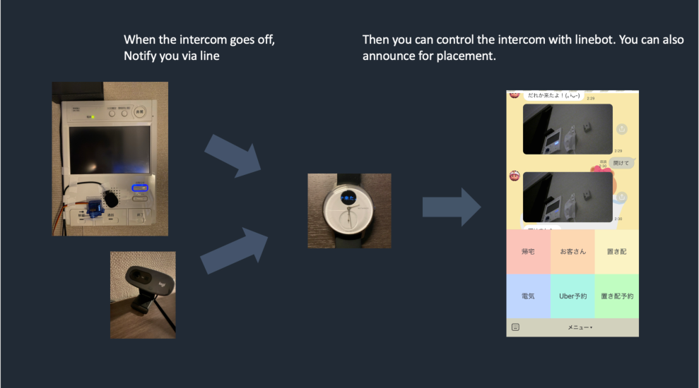

# HomeVisitLINEBot
This repository is an updated project developed in [JPHACKS](https://github.com/jphacks/TK_2302).

## Overview
Intercom control with servo motors and speaker using Raspi via lineAPI.

### Divice
- RaspberryPi4
- [Logicool HD720P](https://www.amazon.co.jp/gp/product/B07QMKND9M/ref=ppx_yo_dt_b_search_asin_image?ie=UTF8&th=1)
- [HM05-5007](https://www.amazon.co.jp/gp/product/B09BN9N1P3/ref=ppx_yo_dt_b_search_asin_image?ie=UTF8&psc=1)
- [HS-MC09UBK](https://www.amazon.co.jp/gp/product/B0B4NMT31T/ref=ppx_yo_dt_b_search_asin_title?ie=UTF8&psc=1)
- servo motor

### API・Data
- LINE Messaging API
- LINE Notify API

### Framework・service
- FastAPI
- cloudflare(or ngrok)

## How to use this rep
1. Please fft the intercom sound.[How to fft the intercom](https://github.com/yukiwith5267/Linebot-Unlocker/tree/main/fft)

2. Create a LINE Bot and obtain the `LINE USER ID`, `Channel Secret token` and `Access token`.
Also, you will need the `LINEnotify token` and the `OPENAI` api key.
The `Switch bot api` is optional. (It remotely controls electricity.)

```.env
LINE_CHANNEL_SECRET_TOKEN=<Your_LINE_Channel_Secret_Token>
LINE_CHANNEL_ACCESS_TOKEN=<Your_LINE_Channel_Access_Token>
OPENAI_API_KEY=<Your_OpenAI_API_Key>
LINE_USER_ID=<Your_LINE_User_ID>
SWITCHBOT_AUTH_TOKEN=<Your_SwitchBot_Auth_Token>
LINE_NOTIFY_TOKEN=<Your_LINE_Notify_Token>
```

## Run main.py and notify.py in tmux

```bash
# Update system and install dependencies
sudo apt-get update
sudo apt-get upgrade -y
sudo apt-get install tmux portaudio19-dev libopenblas-dev python3-pandas fswebcam -y

# Setup virtual environment
python -m venv env
source env/bin/activate
pip install -r requirements.txt

# Start sessions in tmux for concurrent script execution
# Session 1: Run notify.py
tmux new-session -d -s mySession 'source env/bin/activate; python notify.py'

# Session 2: Run main.py
tmux new-window 'source env/bin/activate; sudo pigpiod; uvicorn main:app --host 0.0.0.0 --port 8000 --reload'
```

## How to publish the localhost of the Raspi to the Internet
There are two ways to publish localhost to the Internet: using ngrok and using cloudflare.

**Using ngrok:**
Sign in to [https://ngrok.com/](https://ngrok.com/) and get your Authtoken.

```bash
wget https://bin.equinox.io/c/4VmDzA7iaHb/ngrok-stable-linux-arm.zip
unzip ngrok-stable-linux-arm.zip
chmod +x ngrok
sudo mv ngrok /usr/local/bin/
ngrok authtoken YOUR_AUTHTOKEN
ngrok http 8000
```
With ngrok, you cannot specify a custom domain.
Also note that the url will be changed each time you launch ngrok.

**Using Cloudflare Tunnel:**
First, you need to get a domain name using a service such as [Squarespace](https://domains.squarespace.com/). This usually costs a fee.
Configure the DNS servers to cloudflare for the domain that you have gained.

## Sets the webhook url 
Set the webhookurl of the LINE bot to the url you obtained.
You must add `/callback` to the end of the url statement.

## Demo application

