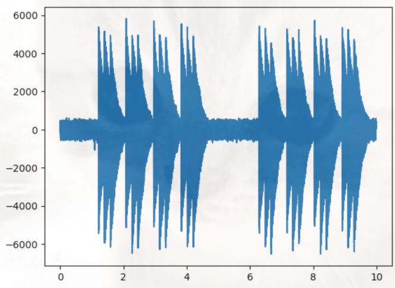
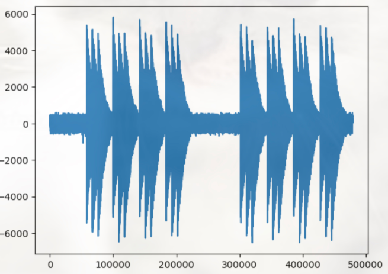
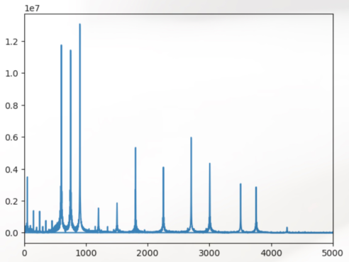

### 1. Get the device ID of the USB microphone connected to the RasPi.

```
python check_dev_id.py
```
```check_dev_id.py
import pyaudio

p = pyaudio.PyAudio()

for i in range(p.get_device_count()):
    info = p.get_device_info_by_index(i)
    print(f"Device {i}: {info['name']}")

```

### 2. Recording the intercom sound

python record.py
```
```record.py
import pyaudio
import wave
input_device_index = 1 # Device number checked by check_dev_id.py
CHUNK = 4096
FORMAT = pyaudio.paInt16
CHANNELS = 1
RATE = 48000
RECORD_SECONDS = 10
WAVE_OUTPUT_FILENAME = "output.wav"

p = pyaudio.PyAudio()
stream = p.open(format=FORMAT,
                channels=CHANNELS,
                input_device_index = input_device_index,
                rate=RATE,
                input=True,
                frames_per_buffer=CHUNK)

print("Recording...")
frames = []
for i in range(0, int(RATE / CHUNK * RECORD_SECONDS)):
    data = stream.read(CHUNK, exception_on_overflow=False)
    frames.append(data)
print("Done!")
stream.stop_stream()
stream.close()
p.terminate()

stream.stop_stream()
stream.close()
p.terminate()

wf = wave.open(WAVE_OUTPUT_FILENAME, 'wb')
wf.setnchannels(CHANNELS)
wf.setsampwidth(p.get_sample_size(FORMAT))
wf.setframerate(RATE)
wf.writeframes(b''.join(frames))
wf.close()
```

### 3. FFT.ipynb
1. Plot time-amp index-amp graph from output.wav
```
import wave
import numpy as np
import matplotlib.pyplot as plt
 
file_name = "output.wav" 
RATE = 48000 

wf = wave.open(file_name, "rb")
data = np.frombuffer(wf.readframes(wf.getnframes()), dtype='int16')
wf.close()

x = np.arange(data.shape[0]) / RATE
plt.plot(x, data)
plt.show() # time(sec)-amp
x = [i for i in range(len(data))]
plt.plot(x, data)
plt.show() # index-amp
```

`output`
<div style="text-align:center;">
  
</div>
<div style="text-align:center;">
  
</div>


2. Set the index (↓start arg) at a convenient (ringing or peak) position.
Execute FFT

```
import wave
import numpy as np
import matplotlib.pyplot as plt
 
file_name = "output.wav" 
RATE = 48000 
CHUNK = 1024 * 8 
RECORD_SECONDS = 1 # Sec to FFT
pnts = int(RATE / CHUNK * RECORD_SECONDS) * CHUNK

start = 58000 # <-Trial

wf = wave.open(file_name, "rb")
data = np.frombuffer(wf.readframes(wf.getnframes()), dtype='int16')
wf.close()

data = data[start:start+pnts]
fft_data = np.abs(np.fft.fft(data))   
freqList = np.fft.fftfreq(data.shape[0], d=1.0/RATE) 
plt.plot(freqList, fft_data)
plt.xlim(0, 5000)    # Shows from 0 to 5000 Hz
plt.show()

```
`output`



3.Set strength and extract data for detection. 


```
import wave
import numpy as np
import matplotlib.pyplot as plt
import pandas as pd
 
file_name = "output.wav"
RATE = 48000 
CHUNK = 1024 * 8
RECORD_SECONDS = 1 
pnts = int(RATE / CHUNK * RECORD_SECONDS) * CHUNK 

start = 58000

wf = wave.open(file_name, "rb")
data = np.frombuffer(wf.readframes(wf.getnframes()), dtype='int16')
wf.close()

data = data[start:start+pnts]
fft_data = np.abs(np.fft.fft(data))
freqList = np.fft.fftfreq(data.shape[0], d=1.0/RATE)

df = pd.DataFrame(dict(freq = freqList, amp = fft_data))
df = df[df['freq']>500] # Eliminate below 500 Hz
df = df[df['amp']>5000000] # Remember the point with a strength of more than 5000000.
print(list(df.index))
# [510, 511, 512, 513, 514, 515, 516, 639, 640, 641, 642, 643, 644, 768, 769, 770, 771, 1539, 2308, 2309]
print(list(df['freq']))
# [597.65625, 598.828125, 600.0, 601.171875, 602.34375, 603.515625, 604.6875, 748.828125, 750.0, 751.171875, 752.34375, 753.515625, 754.6875, 900.0, 901.171875, 902.34375, 903.515625, 1803.515625, 2704.6875, 2705.859375]
print(len(df))
``` 

4. Calculate amp that is total strength of the extracted frequency components.
```
import wave
import numpy as np
import matplotlib.pyplot as plt
import pandas as pd
 
file_name = "output.wav"
RATE = 48000 
CHUNK = 1024 * 8
RECORD_SECONDS = 1 
pnts = int(RATE / CHUNK * RECORD_SECONDS) * CHUNK 

freq_indices = [510, 511, 512, 513, 514, 515, 516, 639, 640, 641, 642, 643, 644, 768, 769, 770, 771, 1539, 2308, 2309]

start = 58000 

wf = wave.open(file_name, "rb")
data = np.frombuffer(wf.readframes(wf.getnframes()), dtype='int16')
wf.close()

data = data[start:start+pnts]
fft_data = np.abs(np.fft.fft(data))   

amp = 0
for i in freq_indices:
    amp += fft_data[i]

print('{:.2e}'.format(amp))
```

5. Replace `threshold` in main.py with `amp` value. and set freq_indice = [].
```main.py

RECORD_SECONDS = 1
threshold = 5.0e6
threshold2 = 5
freq_indices = [510, 511, 512, 513, 514, 515, 516, 639, 640, 641, 642, 643, 644, 768, 769, 770, 771, 1539, 2308, 2309]
freq_indices2 = [f * 2 for f in freq_indices]

input_device_index = 1
CHUNK = 1024 * 8
FORMAT = pyaudio.paInt16
CHANNELS = 1
RATE = 48000
rng = int(RATE / CHUNK * RECORD_SECONDS)
```
